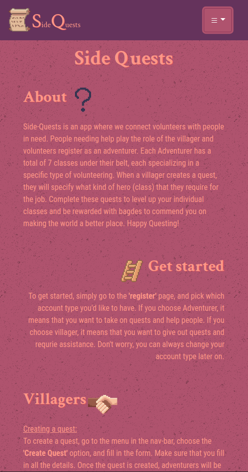
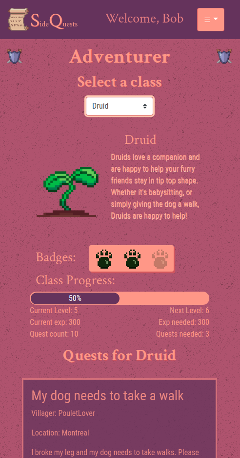
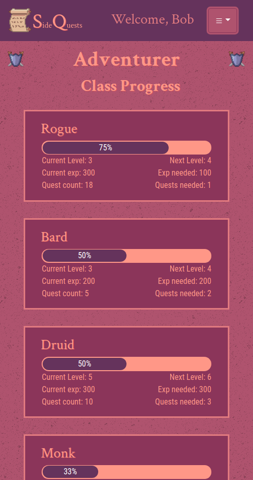
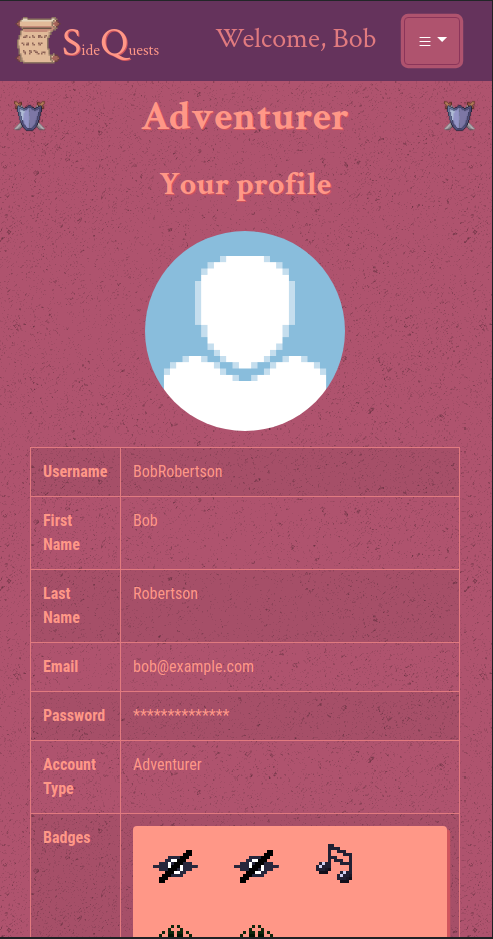
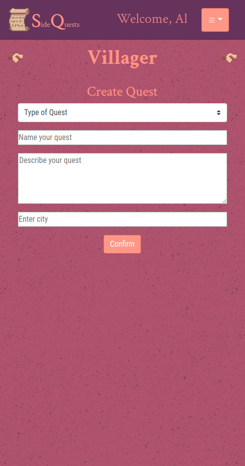
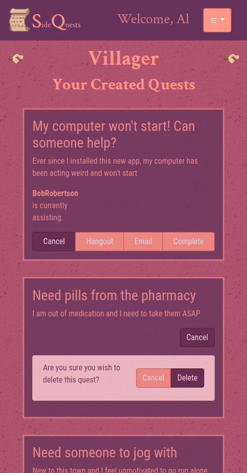
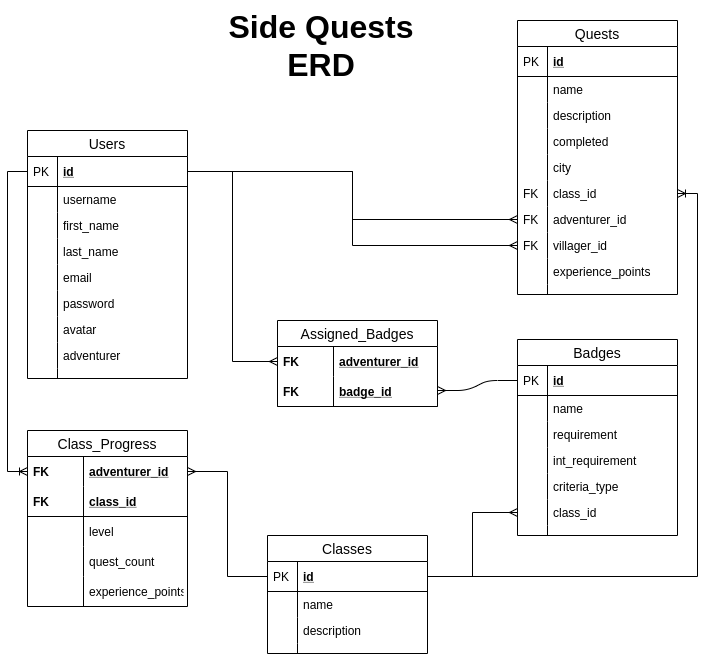

# Side Quests

SideQuests is a web app which facilitates helping people in need, solving current world issues on a small scale with a fun fantasy theme. As an adventurer, you can pick a class, view what villager requests are available to you in your area, and complete them to earn badges, and level up your character. As a villager, you can post a request, and get the help of an adventurer in your area depending on the request type.

## User Stories

- As someone who was recently diagnosed with a contagious disease and who has no family living nearby, I need to ask for help to run daily errands so that I won't spread the disease around.
- As someone who has mobility issues, I like to have a community of people who are willing to help me spontaneously.
- As an able bodied person, I am free to run errands. When I go to the pharmacy, I like to see if I can't also get something for someone who is unable to do the same.
- As someone who likes to do things right, I like to be able to ask details about the task that I'm asked to do.
- As someone with a lot of free time, I like to spend some time helping those who are most in need in my area.
- (stretch) As someone who still wants to pay for my own things, I like to be able to decide if my errand that I am asking for is free or if I will pay for it.

## Getting Started

To get started, you must install the dependencies in both the back-end and the front-end, and then run them in parallel.

### Getting the back-end ready:

1. Go to the "back-end" directory and run `npm install` to install all the dependencies
2. Create a psql database, e.g. `create database sidequests;` using the psql client
3. Create a new psql user, e.g. `create user quester;` using the psql client
4. Seed the database from the root directory `\i back-end/db/db_setup` (note: this will drop your db tables if they already exist)
5. Make a copy of the `.env.example`, rename it to `.env`, and fill in the db config details
6. Run `npm run dev`

### Getting the front-end ready:

1. Go to the "client" directory and run `npm install` to install all the dependencies
2. Make sure the back-end is ready and running
3. Run `npm start`
4. Go to http://localhost:3000 and enjoy _Side-Quests_!

## Stacks

### Front End

- React
- Scss
- Bootstrap

### Back End

- Express.js
- Node.js

### Database

- PostgreSQL

## Finished Product

About page:

Class selection & available quests:

All quests that have been accepted:

Progress for all classes:

User profile:

Villager view, create a new quest:

Villager's created quests:

## Routes

| HTTP METHOD | URL PATTERN        | USE                 |
| ----------- | :----------------- | ------------------- |
| POST        | /register          | Register new user   |
| POST        | /login             | Login existing user |
| GET         | /users             | Get users           |
| GET         | /users/:id         | Get data for user   |
| GET         | /quests            | Get all the quests  |
| POST        | /quests/:id/new    | Add a new quest     |
| GET         | /quests/:id        | Get a single quest  |
| PUT         | /quests/:id/edit   | Edit a quest        |
| DELETE      | /quests/:id/delete | Delete a quest      |
| GET         | /badges            | Get all badges      |
| GET         | /badges/:id        | Get a single badge  |
| GET         | /classes           | Get all classes     |
| GET         | /classes/:id       | Get a single class  |

## ERD

